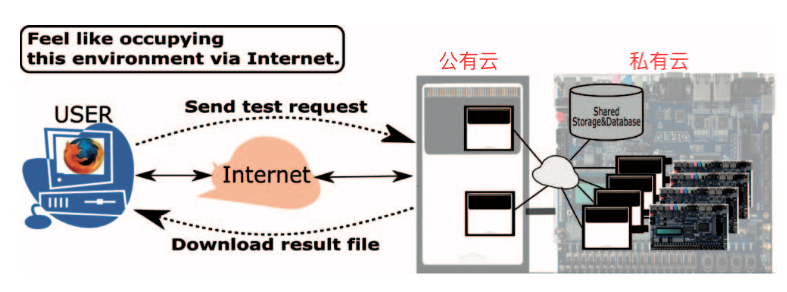
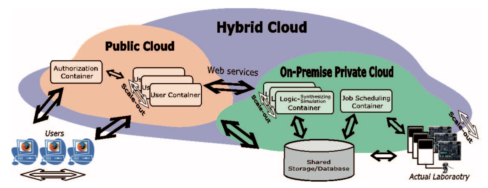
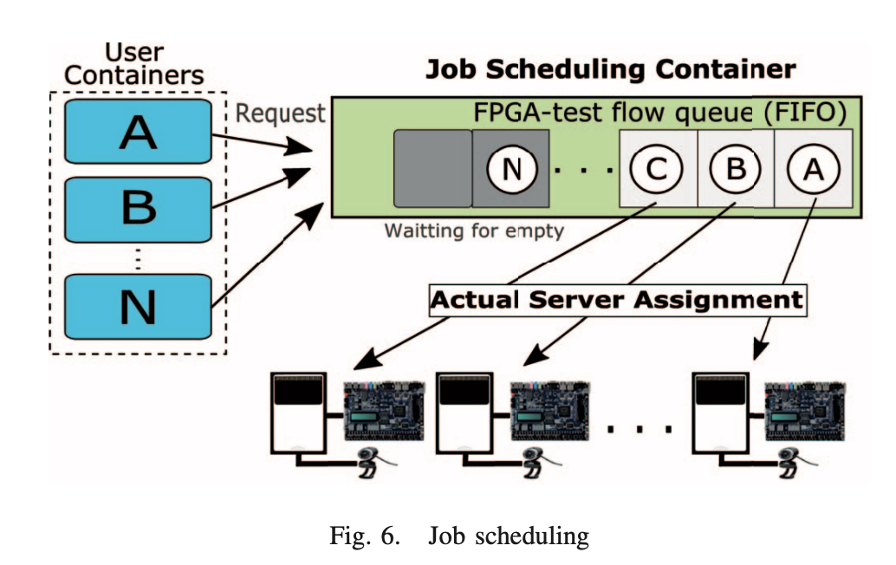
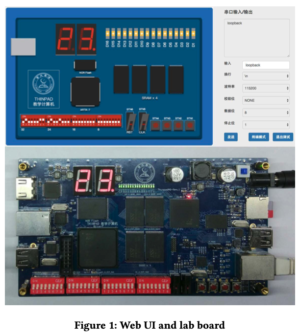
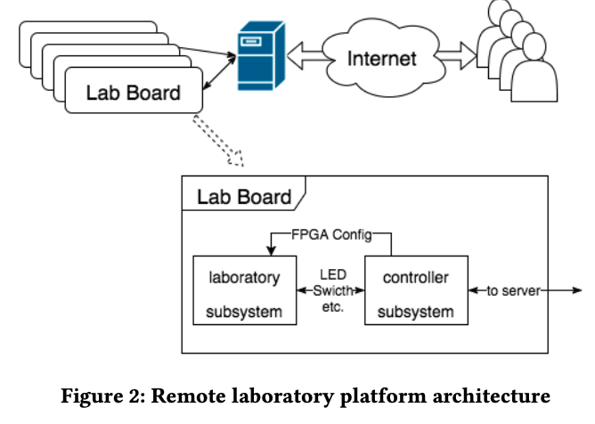

<!-- START doctoc generated TOC please keep comment here to allow auto update -->
<!-- DON'T EDIT THIS SECTION, INSTEAD RE-RUN doctoc TO UPDATE -->
**Table of Contents**  *generated with [DocToc](https://github.com/thlorenz/doctoc)*

- [框架设计](#%E6%A1%86%E6%9E%B6%E8%AE%BE%E8%AE%A1)
  - [FPGA远程实验室](#fpga%E8%BF%9C%E7%A8%8B%E5%AE%9E%E9%AA%8C%E5%AE%A4)
    - [International Conference on Remote Engineering and Virtual Instrumentation](#international-conference-on-remote-engineering-and-virtual-instrumentation)
      - [An FPGA-based Remote Laboratory: Implementing Semi-Automatic Experiments in the Hybrid Cloud](#an-fpga-based-remote-laboratory-implementing-semi-automatic-experiments-in-the-hybrid-cloud)
      - [IoT Remote Group Experiments in the Cyber Laboratory: A FPGA-based Remote Laboratory in the Hybrid Cloud](#iot-remote-group-experiments-in-the-cyber-laboratory-a-fpga-based-remote-laboratory-in-the-hybrid-cloud)
    - [ACM TUR-C（ACM图灵奖50年中国大会-会议）](#acm-tur-cacm%E5%9B%BE%E7%81%B5%E5%A5%9650%E5%B9%B4%E4%B8%AD%E5%9B%BD%E5%A4%A7%E4%BC%9A-%E4%BC%9A%E8%AE%AE)
      - [Remote FPGA Lab Platform for Computer System Curriculum](#remote-fpga-lab-platform-for-computer-system-curriculum)
  - [其他文章](#%E5%85%B6%E4%BB%96%E6%96%87%E7%AB%A0)
      - [On the Evolution of Remote Laboratories for Prototyping Digital Electronic Systems](#on-the-evolution-of-remote-laboratories-for-prototyping-digital-electronic-systems)
      - [An FPGA-based Remote Laboratory: Implementing Semi-Automatic Experiments in the Hybrid Cloud](#an-fpga-based-remote-laboratory-implementing-semi-automatic-experiments-in-the-hybrid-cloud-1)
- [相关期刊](#%E7%9B%B8%E5%85%B3%E6%9C%9F%E5%88%8A)
  - [Computers & Education](#computers--education)
    - [相关](#%E7%9B%B8%E5%85%B3)
      - [Educating online student teachers to master professional digital competence: The TPACK-framework goes online](#educating-online-student-teachers-to-master-professional-digital-competence-the-tpack-framework-goes-online)
      - [Virtual laboratories for education in science, technology, and engineering: A review](#virtual-laboratories-for-education-in-science-technology-and-engineering-a-review)
    - [其他](#%E5%85%B6%E4%BB%96)
      - [Learning and instruction in the hybrid virtual classroom: An investigation of students’ engagement and the effect of quizzes](#learning-and-instruction-in-the-hybrid-virtual-classroom-an-investigation-of-students-engagement-and-the-effect-of-quizzes)
      - [Critical evaluation of existing audio learning systems using a proposed TOL model](#critical-evaluation-of-existing-audio-learning-systems-using-a-proposed-tol-model)
      - [The effects of integrating mobile devices with teaching and learning on students' learning performance: A meta-analysis and research synthesis](#the-effects-of-integrating-mobile-devices-with-teaching-and-learning-on-students-learning-performance-a-meta-analysis-and-research-synthesis)
  - [The Internet and Higher Education](#the-internet-and-higher-education)
    - [相关](#%E7%9B%B8%E5%85%B3-1)
      - [。。。](#)
      - [...](#)
    - [其他](#%E5%85%B6%E4%BB%96-1)
      - [Developing Asynchronous MBA Courses in the World Wide Web](#developing-asynchronous-mba-courses-in-the-world-wide-web)

<!-- END doctoc generated TOC please keep comment here to allow auto update -->


---


---

# 框架设计

---

## FPGA远程实验室

---

### International Conference on Remote Engineering and Virtual Instrumentation


---

#### An FPGA-based Remote Laboratory: Implementing Semi-Automatic Experiments in the Hybrid Cloud
一个基于FPGA的远程实验室：在混合云中实现半自动FPGA运行实验

```
2016
13th International Conference on Remote Engineering and Virtual Instrumentation
(REV)
SCI 会议？
```

很完善，然而没有实时性。

- abstract

```
设计文件和包含FPGA运行参数的FPGA测试流文件被发送到混合云，
以自动触发以下任务的序列：逻辑合成、逻辑仿真和FPGA运行，并进行视频记录。

每个用户都可以通过web浏览器访问远程实验室，并通过web服务和WebSockets与实验任务管理器进行通信。
由于管理者作为用户的代理，实现了半自动实验，用户可以集中精力进行高层次的设计。

The user can get the feeling of the exclusive
and interactive use of an FPGA-based experiment platform,
while allowing efficient sharing of the platforms at the same time.
用户可以感受到基于现场可编程门阵列的实验平台的独享性和交互性，同时允许平台的高效共享。

在设备使用冲突的情况下，任务管理器通过以 ·空间· 和 ·时间· 划分的方式重新分配平台来解决冲突。
```


- introduce

    + 即时测试

        为了不无效占用资源（利用矢量文件实现FPGA的测试自动化[3]成为克服这些缺点的重要解决方案），解决

    + 伸缩性问题     

        实际平台数量有限。   
        通过混合云（云计算：公有云和私有云结合），解决伸缩性问题。

        在公有云和私有云都进行划分

        * 空间划分

            分配给不同用户不同板子

        * 时间划分

            在资源都被占用的情况下，在同一块板子上分配给不同用户不同的时段（排队）

    + 设备冲突

        在设备使用冲突的情况下，任务管理器通过以 ·空间· 和 ·时间· 划分的方式重新分配平台来解决冲突。


```
近年来，许多基于FPGA的远程实验室被提出。
大多数这样的系统提供的功能要么是模拟实验环境，要么是允许通过互联网独家远程使用实际设备。
此外，平台的使用有两种不同的方式，即非实时和实时。

在非实时的情况下，它成功地有效地利用了FPGA的开发和实验环境
而没有意识到诸如FPGA设备（FPGA devices）之类的资源[1]。

在实时情况下，利用网络摄像机和虚拟遥控器，
实现了对现场可编程门阵列（FPGA）和现场可编程门阵列（FPGA）板视频的交互专用[2]。

然而，由于重复的失败设计和FPGA的运行周期，通常需要很长的时间。
在这两种情况下，如果设计包含错误，则会导致时间浪费和平台使用效率低下。

The test automation of FPGA by making use of the vector files[3]
becomes an important solution to overcome such shortcomings.
利用矢量文件实现FPGA的测试自动化[3]成为克服这些缺点的重要解决方案。

以前的远程实验室系统也使用实际的实验室机器作为远程实验室平台。
然而，实际平台数量有限，存在可伸缩性问题。使用云计算成为解决这个问题的方法。
然而，基于FPGA的实验环境不能迁移到公共云解决方案，
因为FPGA设备和许可的合成工具与实验室机器紧密耦合
(because the FPGA devices and the licensed synthesis tools
are tightly coupled with laboratory machines)。
因此，一个混合云组织将实验室机器包含在一个内部私有云中，
并将实验服务包含在一个公共云中，就成为了解决方案。

本文提出了一种可在混合云中实现半自动现场可编程门阵列运行实验（SAFRE）的现场可编程门阵列远程实验室原型。
这个远程实验室是基于Altera DE2-115板[4]开发的，每个板都配有一个专用服务器。
授权的逻辑合成和安全程序已经作为私有云中的Web服务实现。

为了保证可扩展性，Verilog HDL中的设计、原理图捕获、逻辑仿真、实验后分析调试等任务都迁移到了公共云上。
由于Verilog-HDL和FPGA测试流（FTF）文件只在系统服务器间传输，在这种混合云中可以实现有效的远程实验室系统。
该远程实验室的新特点是，在用户通过FTF文件和虚拟控件共享资源和设备的环境中，实现了对FPGA的自动化测试。
这种半自动机制允许用户在任何设计阶段检查结果。
因此，用户可以在自动解决平台使用冲突的同时，利用所提出的FPGA远程实验室对自己的设计进行实验。
```

- **system considerations**


    Basis concept of the proposed FPGA remote laboratory

    </img>

    </img>

    + 使用容器而不是虚拟机（VM）

        * 容器比vm更轻、更便携；引导和关闭操作比vm快得多。
        * 可以缩短缩小时间和缩小时间
        * 容器共享主机IP地址，因为容器不能拥有自己的IP地址，以便通过internet与外部计算机连接
        * 图4示出了如何通过因特网与服务器中的容器建立多个连接。
        * 容器使用主机中的端口转发和单独的链接端口连接到外部网络。

    + 混合云

        - 公共云

            为用户提供独立于设备的服务

            * 容器：   

                1）授权容器

                此容器充当用户授权的web服务器。   
                用户执行用户授权，该授权检查来自SSDB（shared storage/database）的用户信息。如果用户授权成功，则授权容器将为用户引导一个用户容器，并打开一个单独的端口，用于连接用户以区别于其他容器端口。

                2）web应用程序服务控件的用户容器

                该容器包含一个 **web服务器** 和 **与FPGA远程实验室的这些服务相对应的相关web应用程序**，例如将文件上传到SSDB、获取错误和成功消息、检查Verilog HDL语法以及通过web向私有云中的该实验室服务器发出执行请求支持WebSocket协议的浏览器。
                用户可以向SSDB上传/下载必要的文件，并通过该容器中的web应用程序向本实验室发出执行请求和FTF文件。

                - 语法检查器

                    此外，此容器在将用户设计的文件上载到SSDB之前，对用Verilog HDL编写的文件执行 **简单的语法检查**。如果设计文件中存在语法错误，则用户容器不会将其上载到SSDB。
                    相反，它以web服务返回值的形式将错误消息返回给用户。OSS Icarus Verilog[5]方便Verilog HDL语法错误检查。


        - 内部私有云

            用于FPGA实验

            + 构成：

                * 容器：

                    1）用于HDL编译的逻辑合成和模拟容器

                    该许可容器创建Verilog HDL的顶层模块，该顶层模块包含用户对FPGA运行的设计，并使用Altera Quartus II软件编译顶层模块文件[6]。

                    当这个容器接收到请求时，它会在执行逻辑合成和逻辑模拟之前从SSDB下载所需的Verilog HDL文件，然后将生成的文件存储回SSDB。

                    如果Verilog HDL描述包含语法错误，则此容器不会将设计文件上载到SSDB；它会返回错误以让用户知道语法错误。

                    当用户向本实验室发出执行请求时，此容器将FTF文件转换为Verilog HDL文件，用于逻辑模拟。转换完成后，容器下载所需的设计文件，并使用Icarus Verilog执行逻辑模拟。

                    由于FTF文件主要由一系列开关和按键信号组成，可以很容易地转换成Verilog HDL文件进行逻辑仿真，因此FTF转换非常简单。

                    2）用于分配实际服务器的作业调度容器 -- JSC（Job Scheduling Containers）：

                    

                    参考图6，该容器管理多个实际服务器以调度FPGA运行服务。

                    当来自用户容器的对FPGA运行服务的请求到达时，JSC将作业分配给实际实验室中空闲的实际服务器。

                    当多个用户同时请求相同的服务时，它可以解决用户之间的冲突。

                    如果所有实际服务器都很忙，JSC会将新请求推送到作业队列中，并让它们等待实际服务器中其他作业的完成。其中一个服务器完成其服务后，JSC以先到先得的服务方式将位于作业队列顶部的作业分配给服务器。

                    由于设备相关服务或许可的工具服务不能在同一服务器内同时执行，JSC以空间划分和时间划分的方式将这些服务分配给可用的实验室机器。

                    当实际服务器完成作业时，实际服务器会通知JSC终止。

                * SSDB 用户共享资源的共享存储/数据库

                    所有资源，如用户信息、上传的Verilog HDL设计文件、FTF文件、FPGA运行文件、结果视频和逻辑模拟文件（VCD文件）都存储在SSDB中。所有容器都可以访问SSDB并上传/下载必要的文件。所有Verilog HDL文件都无语法错误，因为驻留在公共云中的Verilog HDL编译器可以在上传到SSDB之前检查源文件的语法。SSDB提供了无缝的环境，FPGA远程实验室可以作为后台工作。

            + 实际组织

                * 现场可编程门阵列和网络摄像机的实际服务器

                    由于用户无法直接控制或监控远程FPGA器件的行为，因此，采用虚拟控制器和网络摄像机来实现远程实验环境。虚拟控制器用于模拟手动按键或开关操作，以控制FPGA的运行。
                    网络摄像机记录了整个现场可编程门阵列运行服务期间的现场可编程门阵列板行为，记录的视频文件存储在固态数据库中，以供用户进一步检查

                * **半自动** FPGA实验系统（Semi-Automatic FPGA-Run Experiment SAFRE）

                    ***当请求来自JSC（Job Scheduling Containers）时，SAFRE系统执行FPGA和FTF文件一起运行。该文件包含按键和推/拉控制开关的操作顺序等信息。它根据用户定义的测试序列，通过UART（通用异步收发传输器--芯片控制）控制FPGA的操作。因此，用户可以使用测试程序来模拟手动按键操作。***
                    在设备使用冲突的情况下，如果空闲服务器可用，则应通过使用不同的服务器顺序或并行地处理服务。


    部分原文：

    ```
    图1示出了所提议的远程实验室的总体概况。
    实现了半自动测试的现场可编程门阵列实验环境，每个用户都能有独占一个实验环境的感觉。

    多个用户可以通过共享实验室平台同时进行这些实验。
    为了减轻实验平台的工作负载，采用了混合云方案：

    一些实验室平台被组织为内部私有云，在那里设备相关服务和许可软件服务应该以Web服务的形式运行，
    其余的实验服务从它们卸载并迁移到公共云。
    SAFRE通过在公共云中为每个用户分配一台服务器
    和在本地私有云中为每个用户分配一个实验室平台来实现测试自动化，
    包括空间划分和时间划分两种方式。从而实现一个可扩展、高效的远程实验室。
    ```

    服务器的数量可以根据用户使用情况和季节性负载变化增加或减少。


- 实验过程：

    首先，用户上传Verilog HDL文件。

    其次，用户通过如图11所示的web应用程序创建如图10所示的FPGA pin设置和FTF文件。

    最后，用户选择任务并发送服务请求。

    如果用户已经执行了这些过程，则用户可以跳过并重用这些结果。

    实验完成后，用户可以通过web应用程序下载实验结果。

    部分原文

    ```
    第一步是通过用户授权网页登录系统。

    授权成功后，用户可以通过web浏览器和WebSocket协议访问用户控制网页。
        首先，用户认证处理由管理器在授权容器中执行。
        如果身份验证成功，则可以启动用户容器。
        打开端口后，用户可以通过用户容器中的web浏览器使用WebSocket协议连接到web服务。
        该协议用于实现服务器和用户端计算机/平板电脑之间更快的双向通信。

        此外，用户容器使用JSON文件
        该文件包含对这些服务的各种请求，以动态上载用户网页并与其他容器交互。

        一旦建立了连接，用户请求总是可以发送到同一个服务器，并获得相应的结果。

        此外，服务器可以使用推送机制随时向用户发送信息，例如当前状态仪表板。

    第一个用户工作是
        通过远程桌面服务，利用他/她自己的计算机或公共云中的服务器，
        准备他/她自己用Verilog HDL编写的高级设计。
        由于设计的文件自动存储在共享存储/数据库（SSDB）中，
        因此混合云中的所有服务器都可以共享这些文件，并且可以避免不必要的文件传输。

    设计完成后
        要求用户提供引脚分配信息和输入的FTF文件信息，
        用于配置FPGA板和搭建实验环境。
        然后根据给定的pin分配和FTF启动自动服务。

    这些服务的工作顺序是
        逻辑检查/编译、高级Verilog HDL逻辑合成、逻辑仿真和FPGA运行。
        此外，用户可以利用许多可用的实验室平台，启动同时执行不同配置的实验。

    - 如果没有足够的平台可用，可以在一个平台上以时分的方式逐个处理一些实验。
    - 由于实验结果自动存储在共享数据库中，用户可以事后查看实验结果。
    - 即使在执行期间用户关闭了容器，用户也可以稍后看到结果，因为结果在数据库中。
    - 所附的现场录像将给用户一个真实的生活实验氛围。

    如上所述，如果没有足够的平台，一个平台可以在非实时模式下执行多个实验。
    ```

    首先是分配板子，如果都被占用，就在同一个设备上分时使用。

    实验结果存储在对应容器中，存储在数据库中，可以下载。

- 验证

    在初步评估中，我们进行了一系列半自动的实验运行，其持续时间固定为5分钟。

    在所有服务完成之前，平均5分钟会超过几秒钟。因此，与单用户实验的独立FPGA平台运行时间相比，实验运行时间没有显著增加。对于5分钟的实验，真实环境和远程环境之间的实验时间差平均可以控制在10秒之内。

    我们比较了利用综合工具和实时5分钟实验的时间和利用这个远程实验室下载实验结果文件（mp4）并发送作业的时间。

    大多数延迟应该来自网络响应和I/O处理中的容器开销。  
    对于实际运行，运行时间根据并发用户数与可用实验室平台数的不同而不同。  
    由于学生用户的实际FPGA运行时间较短，可以采用空分和时分两种方式分配多个实验平台，因此平均运行时间将根据并发学生用户的数量略有增加。

- 总结展望


    原文：
    ```
    介绍了一种基于FPGA的混合云中半自动FPGA运行实验远程实验室的实现。
    远程实验室提供半自动实验服务，避免了用户的繁琐工作，使用方便。

    原型系统已经完成了开发，使用两个PC集群实现作为本地私有云，
    并使用一个公共云作为混合体进行组织。
    远程实验室可以很容易地迁移到任何其他云，因为它是可移植的。
    在实际运行中，Amazon Web服务[7]将被用作公共云。
    至于私有云，将使用OpenStack[8]。

    当前的实现将逻辑综合服务分配给本地实验室服务器。
    但是，如果要增加并发用户的数量，实验室服务器应该过载。
    它会导致经过的时间延长，并导致可伸缩性问题。
    如果能够解决安全问题和适当的许可工具管理问题，
    那么将逻辑合成服务从私有云迁移到公共云将是一个解决方案。

    我们将继续努力实现进一步的测试自动化，并将实时功能添加到实际的服务器中。
    在成功的原型评估之后，
    我们计划将实验公共云集群迁移到实际的公共云，即Amazon Web服务（AWS）。
    通过将现有的私有云（实验室服务器）和AWS公共云结合起来作为一个混合云，
    可以实现一个可扩展和高效的远程实验室。
    它们应该适合学术硬件实验实验室使用。
    ```


---

#### IoT Remote Group Experiments in the Cyber Laboratory: A FPGA-based Remote Laboratory in the Hybrid Cloud

- abstract

    部分原文
    ```
    作者提出了一种在网络实验室中进行物联网实验的远程实验室系统，
    该系统是一个基于FPGA的面向未毕业大学生的远程教育实验室。
    它不仅可以使用可用的板级小型计算机，还可以使用FPGA板来制作物联网边缘的原型。
    它还可以在混合云中组织物联网云服务器端程序。

    基于FPGA的边侧计算方法可以具有更大的自由度和灵活性来实现各种传感器控制，
    这些传感器可以为特定的物联网应用定制。

    使用免费的微处理器IP核，重新组织现有的FPGA CAD设计平台，
    使我们能够减轻设计和实现工作的负担，为构建新的网络实验室，以适应物联网设计和实验。
    这也有助于减少学生进行自己的物联网设计和实验的工作量，

    要求学生具备各种信息技术技能：
    硬件设计、边缘计算、服务器端计算、网络和基础设施建设。
    Docker container/Swarm和Docker文件的使用
    有助于以“基础设施即代码”的形式为每个学生自动构建自己的物联网实验平台。

    此外，这些单独设计的物联网实验平台可以结合起来，同时进行一组群实验。

    本文展示了网络实验室在物联网类远程实验中的实用性和适用性。
    ```
- introduce

    部分原文
    ```
    本文提出了一种基于FPGA的混合云硬件实验室，
    也是Cyber Laboratory[2，3]中包含的物联网实验系统的实现方案。
    最初的Cyber Laboratory利用了公共云的向外扩展能力和
    内部私有云对任何I/O设备（即在FPGAs中实现的物联网设备）的自由连接[4]。

    为了进行物联网设计和实验，需要各种各样的IT技能。
    在物联网实验中，FPGA在边缘端和云服务器端处理中都扮演着重要角色。
    现场可编程门阵列中的传感器控制器接收来自服务器的命令并获取传感器数据，
    并通过互联网发送给服务器[9]。
    然后，云服务器在FPGAs的帮助下，对测量数据进行积累、分析和可视化[10]。

    为了实现这样一个物联网系统级的实验环境，
    每个学生必须首先准备Verilog HDL中描述的物联网边缘设备设计和
    用于内置IP核的边缘侧计算机程序。
    此外，还应准备云端物联网服务器程序。
    对于熟练的学生来说，服务器端的FPGAs可以用来加速他们的服务器任务。
    接下来是基础设施建设阶段，这曾经是一个障碍。
    因为，基础设施建设任务必须由管理者利用学生提供的纸质文件来完成。
    基础设施工作包括许多繁琐的任务，
    如多个物联网设备设置、云端服务器设置以及它们之间的连接。
    为了自动构建物联网实验系统，
    采用了Docker容器[5]、Docker Swarm[11]和Docker文件相结合的方法。
    如果课程管理员曾经以Go代码编写的Docker文件的形式准备了一种模板，
    那么每个学生都可以很容易地理解以Go代码编写的模板形式的基本系统构建过程，
    并且可以很容易地为自己特定的物联网系统定制模板。
    Docker Swarm可以处理可用的FPGA设置/运行容器，这些容器连接独立的FPGA板，并以空间划分的方式将这些空闲的FPGA板和容器排列分配给每个学生[7]。此外，Docker Swarm发现可用的云端服务器并分配学生服务器容器，这些可以加入学生物联网实验系统。在现有的远程实验室项目的情况下，FPGA设备在整个实验周期中应该被独占用户完全占用，并且它们不能很长时间解决设备使用冲突，并导致FPGA设备使用不佳和等待队列长（6, 8）。另一方面，由于Cyber Laboratory[2]允许按需使用FPGA，并且相应的单实例容器仅在FPGA运行期间占用FPGA，因此可以实现高效的使用FPGA。

    群组调度可以防止以空间分割方式使用物联网设备时发生冲突。
    在没有空间重叠的情况下共享FPGAs是可能的。
    此外，通过将分时方式的共享FPGA与排队机制相结合，
    可以有效地利用有限数量的FPGA器件。

    所有物联网边缘容器和服务器端容器启动后，
    都将等待Docker控制器以Web服务或Web API/Socket形式发出的实验启动信号。
    通过这种方式，学生可以在不涉及繁琐的系统基础设施细节的情况下，
    积累与FPGA硬件设计、传感器/执行器、网络、服务器端编程和大数据相关的技能。
    ```

- 系统设计

    创新：支持小组实验（8个）

    提出了物联网系统设计和实验的远程实验环境。可以同时进行远程组实验。这种功能对于IOT系统实验是不可避免的，其中有大量的FPGA和云服务器是必需的。网络实验室使FPGA在物联网系统的开发阶段和复杂结构实验中得到有效利用成为可能。网络实验室实现了一个高效的基于FPGA的物联网实验远程实验室。

    在物联网系统中，边缘设备实现边缘计算和传感器控制，处理各种传感器设备。此外，这些物联网群组实验可以再次组合在一起，形成一组群组实验。它们被放入集合队列，直到所有组实验请求都到达。然后它们都以帮派调度的方式分配给物理实验室服务器。

    微服务架构与Docker container/Swarm结合，在混合云环境下实现了一个高效、可扩展的基于现场可编程门阵列的物联网系统远程实验室。

---

### ACM TUR-C（ACM图灵奖50年中国大会-会议）

---

#### Remote FPGA Lab Platform for Computer System Curriculum

Tsinghua - 2017

本文提出了一种面向计算机系统实验的MOOC-ready在线FPGA实验平台。  
设计的目的是为用户提供高度近似的体验和结果作为离线实验。    
利用SoC-FPGA作为实验板的控制器

本文介绍了一个针对计算机系统课程实验优化的远程FPGA实验平台。    
我们设计了一个支持在线和离线实验的FPGA实验板和软件。    
图1给出了实验板的远程用户界面和照片。     
其目的是在线实验的实验应接近离线实验，在线实验的结果应离线再现。    
在联机场景中，服务器室内安装了多个实验板，通过网络连接到服务器。    
学生在网页浏览器中操作一个可视化的电路板，所有的操作都在指定的电路板上执行。  



- related work

    ```
    1.基于实际硬件

    在以往的工作中，已经提出了一些在线的FPGA实验室设计方案。
    在文[1]中，通过将FPGA开发板的I/O口连接到PC的并行口，验证了远程FPGA实验室的概念。
    为了显示真实硬件的状态，在[6]和[2]中使用了网络摄像头。
    [6] 利用Altera的系统内存内容编辑器和FPGA内部的逻辑实现虚拟交换机。
    [2] 采用低成本的单片机作为FPGA与PC机之间的适配器，
    以上实现只提供基本的用户I/O控制，不适合复杂的实验。
    [3]提出了一种可视化的实验室系统。
    它基于NI实验室设备和LabView软件。
    在[4]和[5]中，系统专用逻辑在现场可编程门阵列中与外部USB控制器协作，
    在用户逻辑和服务器之间传输数据。
    要在这个平台上运行，必须在编译之前将用户的逻辑集成到给定的包装器代码中。
    通过USB进行通信也限制了系统的可扩展性，因为考虑到USB主机控制器的带宽，
    一台服务器可能工作在很少的板卡上。

    2.基于仿真平台

    在线数字电路实验室的另一种方法是建立一个基于仿真的平台。
    [8] 提出了一种基于网络的电子电路仿真系统，其中选择了SPICE仿真引擎。
    利用该仿真系统进行计算机系统课程实验的一个主要问题是，
    循环精度模拟器的性能不足以支持复杂的设计（如MIPS32 CPU）。
    几乎不可能对运行操作系统的处理器进行模拟。
    此外，仿真实验结果可能不如实际硬件结果准确。
    ```

- 实验平台设计

    

    建议的平台由 **多个实验室板和至少一台服务器组成**。     
    所有用户交互和实验室管理作业都在服务器上处理，而用户实现的 FPGA 逻辑运行实验室板。登录后，每个用户将被分配到一个实验室板。当用户退出系统时，分配的主板将被回收，并为下一个用户做好准备。

    每个实验室板由两个子系统组成：实验室子系统和控制器子系统。   

    - 实验室子系统

        实验室子系统的所有资源都向分配给该实验室板的用户开放，这意味着 FPGA 完全可编程给用户，没有为远程控制保留任何内容。    

        - 板载资源

            Xilinx Artix-7 系列 FPGA
            具有 101440 个逻辑单元
            四个 2 MB 16 位 SRAM 组织为两个独立的单元，每个单元包含 1 兆 × 32 位。两个单元的地址、数据和控制信号分别路由到FPGA。
            。。。

        - FPGA系统内配置

            远程FPGA实验室的基本功能之一是远程配置FPGA。通过 JTAG 配置 FPGA 的常见方法需要 Xilinx 专有工具，因此很难集成到第三方系统中。
            我们的平台采用 Xilinx FPGA 的"从序列配置"模式。如图 3 所示，配置 FPGA 只需要一个INIT_B信号和两个串行数据序列。可以连接额外的 DONE 信号来监视配置状态。
            用户上传的比特流文件（\*.bit）首先由libxbf[1]解析，以提取配置数据。然后Zynq在INIT_B引脚上发送一个低电平脉冲，将实验室FPGA置于配置状态，配置数据可以通过2线SPI连接传输到实验室FPGA。SPI 时钟运行高达 50 MHz，整个配置过程在不到 1 秒内完成。

    - 控制子系统

        控制器子系统监控实验室子系统，并在实验室子系统和服务器之间交换数据。

        - 控制器核心

            控制器子系统由 Xilinx Zynq-7 SoC FPGA 构建，该接口-A9 处理器集成到 FPGA 结构中。FPGA 和 ARM CPU 共享 DDR 内存。
            考虑到某些功能（例如 LED 采样和开关控制）需要高 I/O 容量，有些（例如总线分析仪）需要实时处理，因此 FPGA 是一个合适的选择。但是，与服务器的网络通信需要软件参与。通过在FPGA中实现硬件接口，在CPU中实现通信软硬件，该设计既具有FPGA和CPU的优点， 又具有二元器件和CPU的优缺点。
            CPU 和服务器之间的连接在 1000M 以太网上建立。板载以太网端口设计为与 PoE 兼容。通过以太网电缆为电路板供电，简化了 mas-sive 部署。

        - I/O 采样和控制

            实验室 FPGA 的所有用户 I/O 信号（如 LED 和开关连接）也路由到 Zynq 进行远程显示和控制。在 Zynq 的可编程逻辑中实现的 GPIO 内核处理 I/O 采样和 con-trol。LED 的采样速率超过 100Hz，足以供人体观察。为了避免物理开关和Zynq设置的不同逻辑电平的碰撞，采用了图4描述的电路设计。

        - 内存总线分析器

            内存总线分析器功能旨在帮助学生调试其内存访问计时。与大多数逻辑分析器一样，此函数能够记录内存总线上的事务并将其显示为波形。在分析器的帮助下，可以轻松解决地址设置时间不足等常见问题。通过检查内存访问序列，还可以找到错误的控制流实现。
            由于 SRAM 和实验室 FPGA 之间的所有内存单数也连接到 Zynq 的可编程逻辑部分，因此所有内存访问均可由控制器监控。内存总线采集开始时，Zynq 中实现的逻辑将等待 W R 和 RD 作为服务器，然后将地址、数据和计时信息存储到内部 FIFO 进行缓冲。最后，FIFO 中的数据写入 DDR 内存，并传输到服务器进行显示。采集可以手动启动和停止，或在内部存储耗尽时自动停止。
        - 串行端口控制器仿真

            为了支持串行端口实验，该平台模拟了 8250 UART 兼容串行端口控制器。它是在可编程逻辑中实现的硬件逻辑，而不是真正的芯片。从串行端口接收的数据通过网络包装并传输到服务器，而来自服务器的用户输入被解包并写入串行端口控制器的数据FIFO。由于串行控制器与内存共享总线的要求，控制器的地址和数据端口可以重用内存总线分析器的引脚，从而节省Zynq的I/O引脚。

        - 静态内存控制器

            静态存储器控制器是控制器子系统中可编程逻辑的一部分。此内存控制器能够读取和写入实验室 FPGA 的 SRAM，通过板上的互连。它仅在实验室 FPGA 未配置时起作用，否则用户逻辑也可能访问 SRAM 并导致争用。集成这种记忆控制器的基本思想是帮助评估学生的工作。在设计学生将数据写入SRAM后，教师可以将实验室FPGA置于未配置状态，然后使用此函数检查SRAM中的内容。SRAM 读写功能在 Web UI 上公开，就像串行通信函数一样。

        - 控制软件

            在 Zynq SoC 的 ARM 端，嵌入 ded Linux 控制可编程逻辑中的所有硬件模块，如 I/O 采样和串行端口。控制软件的主要过程是事件循环，它处理来自服务器和可编程逻辑的事件。接收事件时采取相应的操作。


    - 服务器架构

        服务器程序：Node.js构建。可处理大量并发请求

        server-browser 和 server-board 都是通过socket.io传输（websocket）

        通过 json 传输

        数据库：MongoDB

        前端：Web UI 以纯 HTML、CSS 和 Java 脚本编写，无需依赖过时的 Flash 或 Applet 技术，实现快速页面响应和高浏览器兼容性。


- 平台实验

    - 平台实验构成

        本节列举了一些与计算机系统课程相关的典型实验。平台设计应满足以下实验要求。

        - 数字电路板

            作为数字系统设计的教程，本实验介绍了基本的输入、输出和状态机设计方法。例如，任务可以构建具有段显示的计数器。此外，计数器可以由开关控制，因此需要开关去噪逻辑。另一个例子是ALU（算术逻辑单元）实现。ALU设计需要了解组合运算电路。在这个实验中，在FPGA内部设计的ALU从交换机接收输入，并在LED上显示结果。

        - RAM访问

            存储器是计算机系统的主要组成部分之一。存储器读写是处理器的基本操作。在RAM存取实验中，学生必须设计一个记忆体控制器，产生符合SRAM时序的讯号。如果从RAM读取的数据与其写入的数据相匹配，则认为实现是正确的。

        - 串行口通信

            串口通信是后续实验的基础。学生需要通过读/写串行端口控制器芯片的寄存器与其他设备（如PC）进行通信。除了通信本身，总线仲裁技术也很重要。由于串行控制器芯片与存储器共享总线，因此总线争用必须由硬件逻辑来正确处理。

        - MIPS CPU实现

            实现MIPS处理器是一项艰巨的任务，将计算机组织理论应用于实践。学生应该实现一个处理器，它与给定的简化MIPS ISA兼容。还提供了一个监控程序来验证处理器的实现。

        作为一项挑战任务，需要实现额外的功能，如TLB和ex ception。此任务需要对处理器体系结构和实现技术有更深入的了解。有了这些基本功能，操作系统就可以在处理器上移植和运行。


---

## 其他文章

---

#### On the Evolution of Remote Laboratories for Prototyping Digital Electronic Systems

2007 sci

工业应用数字电子系统的设计可以从现场可编程门阵列（FPGA）平台的原型能力中获得许多好处。

本文介绍了基于FPGA的远程实验室的三个演进版本，并讨论了每个版本背后的教学和技术动机，旨在减少建立和操作实验室环境的开销，设计者和学生可以使用FPGA原型验证他们的设计。

为了实现这一点，引入了许多抽象层，允许在远程FPGA平台中进行配置和数据处理，并将这些平台集成到仿真环境中。所提出的方法支持许多项目，在这些项目中，设计师和学生可以使用一个远程可用的FPGA平台池来指定、改进和原型化电子系统。


---         

#### An FPGA-based Remote Laboratory: Implementing Semi-Automatic Experiments in the Hybrid Cloud

2016 sci 会议

摘要提出了一种在混合云中实现的基于FPGA的半自动FPGA运行实验（SAFRE）远程实验室。设计文件和包含FPGA运行参数的FPGA测试流文件被发送到混合云，以自动触发以下任务的序列：逻辑合成、逻辑仿真和FPGA运行，并进行视频记录。这样可以减少用户的工作量。用户只需准备高级Verilog HDL描述和一些FPGA设备设置参数。提供半自动实验服务的远程实验室管理器负责处理剩余的工作，将现场可编程门阵列的运行结果和现场录制的视频返回给用户进行进一步的检查/调试。这种半自动实验服务消除了许多繁琐的用户工作。每个用户都可以通过web浏览器访问远程实验室，并通过web服务和WebSockets与实验任务管理器进行通信。由于管理者作为用户的代理，实现了半自动实验，用户可以集中精力进行高层次的设计。用户可以感受到基于现场可编程门阵列的实验平台的独享性和交互性，同时允许平台的高效共享。在设备使用冲突的情况下，任务管理器通过以空间和时间划分的方式重新分配平台来解决冲突。

---

# 相关期刊


## Computers & Education

### 相关

#### Educating online student teachers to master professional digital competence: The TPACK-framework goes online

教育在线学生教师掌握专业数字能力：TPACK框架上线

2015 Computers & Education

Technological-Pedagogical-Content-Knowledge (TPACK) framework

- Highlights

    我们探索了两个高等教育学院的在线教师教育课程。

    我们研究了学生教师如何发展专业数字能力

    采用定量与定性相结合的混合设计方法。

    这些方案对专业数字能力的整合很差。

    关于在线教育和数字能力的论述来自不同的利益相关者。

- abstract

    在这篇文章中，我们研究了在线教师教育计划如何利用信息和通信技术（ICT）提高教学和学习的创新方式。

    我们探讨在线教师如何在一般领域和学科领域内实践专业数字能力，以及他们在多大程度上鼓励学生教师发展自己的专业数字能力。

    本文以两所不同的高等学校的在线教师教育课程为研究对象，采用定量和定性相结合的混合设计方法，阐明了本研究的目的和范围。

    我们的研究表明，即使在线教师教育课程是激励教师和学生教师为教学目的发展数字能力的良好途径，但这一方面在实际课程中的整合程度很低，尽管有一些有趣的例子被证明。

    通过对网络教育和数字能力的研究，我们发现它们来源于不同的利益相关者：网络教育的研究来源于两所高校的管理层，而数字能力的研究来源于两所高校的某些教师。

    我们的研究表明，在教师在线教育课程中，创新的解决方案和发展专业数字能力的潜力还有一定的路要走。

- 结构

    本文首先介绍了数字素养和数字能力理论的最新研究综述，并讨论了如何将这些理论纳入教师教育、一般在线教育计划和在线教师教育计划。

    本文介绍了各种理论贡献，如技术教学内容知识（TPACK）框架。

    接着介绍了两个案例，为本文提供了实证数据；这一部分还包括案例研究中应用的方法和数据。

    下一节将介绍研究结果，并讨论这些发现与之前的研究文献之间的关系。

    最后一节从调查结果中得出结论，并在专业数字能力和在线学习的背景下进行讨论。

    ```
    本文的目的和范围是探索在线教师在一般和学科领域内实践数字能力的方式，
    以及他们在多大程度上鼓励学生教师发展自己的专业数字能力。
    此外，我们还探讨了在线教师教育方案如何加强利用信息和通信技术进行教学的创新方式。
    ```


---
#### Virtual laboratories for education in science, technology, and engineering: A review

科技与工程教育虚拟实验室研究综述

Computers & Education

- Highlights

    基于动力学的虚拟实验室的最新进展。

    定义现有技术的关键评价标准。

    虚拟世界的最新技术。

    虚拟世界实验室领域的未来进展。

- 摘要

    本文综述了虚拟实验室和虚拟世界在科学、技术和工程领域的研究现状。讨论了这些领域的主要研究活动，但由于虚拟教育社区中机器人领域的成熟，特别强调了机器人领域。


- 简介

    技术和工程学科对远程教育的需求不断增加，导致采用正式的机构和非正式的大规模在线教育方法开设了新课程。各机构和远程教育提供商正在寻求扩大它们在STE（science、technology、engineering）学科内可以提供的在线课程的数量。在公司里提供专业培训虽然不太正规，但仍然被认为是正规的。这可以包括公司为员工提供的培训，也可以包括为客户公司员工组织的培训。在这些情况下，虚拟实验室至少对于初级和中级培训来说是一种经济的解决方案。另一个方面是所谓的创客运动（Axup等人，2014年，Honey和Kanter，2013年，Sheri等人，2014年）的出现，在这个运动中，感兴趣的人群可以聚集在临时社区项目周围。这方面的一个关键方面是，需要找到合格的参与者，能够涵盖项目中的所有不同问题，而不管他们住在哪里。这种非正式的创新、发展甚至制造方法，需要使用新的方法和工具来支持协作，以及在线“共同创造”新产品和技术。这包括使用能够支持虚拟实验室和在线实验的新平台。


    MOOC提供基于网络的交互式用户论坛，帮助学生、教授和助教建立社区。

    - 两种方式：

        一种是尝试开发具有远程访问的物理（真实）实验室，另一种是开发完全基于软件的虚拟实验室。

        我们主张后一种选择。

        第一种选择是远程访问物理实验室，其主要缺点：

        尽管有可能创建，但可能非常复杂，特别是在所需的通信和感官控制硬件和软件方面，以及设备和维护的总体费用方面。

        此外，它是一个相对低效的解决方案，可扩展性差（一次只有一个学生可以访问特定的工作场所），而且不容易支持更复杂的协作学习场景。


        完全基于软件的虚拟实验室可以避免这些缺点。人们普遍认为，虚拟实验室系统和模拟器是STE教育和培训的理想初始步骤，同时认识到，更高级的学习者仍需要实际操作实际设备的经验。然而，随着计算机图形学、虚拟现实和虚拟世界技术的飞速发展，现实世界中只能做的事情和虚拟世界中可以做的事情之间的界限正在缩小。

    ```
    本文主要方向是 虚拟实验室相关

    而本平台是第一种（具有远程访问的物理（真实）实验室），
    所以看看他如何评价第一种缺点，看看是否有相关解决方案
    ```

---

### 其他

---

#### Learning and instruction in the hybrid virtual classroom: An investigation of students’ engagement and the effect of quizzes    

混合虚拟教室中的学习与教学：学生参与度与测验效果的调查

Computers & Education

- Highlights：

    混合虚拟教室有利于灵活的学习，但具有挑战性。

    关联性是内在动机的一个促成因素。

    当学生远程听课时，内在动机最低。

    开展小测验与所有学生的学习动机呈正相关。

---

#### Critical evaluation of existing audio learning systems using a proposed TOL model

2017.10  Computers & Education

使用提议的TOL模型对现有音频学习系统的临界评估

- Highlights：

    - 提出了音频学习系统的技术、组织和学习（TOL）评价模型。

    - 识别并分类远程学习中使用的各种音频技术。

    - 使用所提出的TOL模型对识别出的音频学习系统进行批判性评价。

    - 提供每个已识别音频技术的优点和缺点。

    - 确定音频MOOC框架开发中的研究差距，并提供适当的建议。

- 摘要：

    这项工作构成了一项更大的研究工作的一部分，该研究工作提倡纯音频学习模式可以发展成为一个成熟的音频MOOC。音频MOOC应采用以学习者为中心的方法，为口语和低识字率人群提供有效的学习能力。

    长期以来，基于音频的学习（包括音频技术的差异）已经成为一种既定的做法，并被证明是向大众传播信息的一种成功手段，特别是对文盲和半文盲人口而言。然而，它作为远程教育模式的一种补充，却没有充分发挥其潜力。

    本文的目的是提供一个在近来的文献中没有的全面评价现有的音频学习系统。没有正式和既定的评估框架来评估这些系统。因此，本文提出了一种技术、组织和学习者（TOL）评价模型，对现有的音频学习系统进行了分析。所提出的评估模型使用了一组50个标准，这些标准来自于对多媒体评估方法和策略的回顾。此外，本文还利用所提出的TOL评估模型中的经验数据对学习中使用的各种音频技术进行了批判性评估。建议开发全面的纯音频学习管理系统/MOOC。此外，所提出的评估模式也可用于选择适合组织学习需要的媒体。

---

#### The effects of integrating mobile devices with teaching and learning on students' learning performance: A meta-analysis and research synthesis

August 2015  Computers & Education

移动设备与教学结合对学生学习成绩的影响：分析与研究

可用于阐述：通过移动设别进行远程学习的好处

- 简介：     
笔记本电脑、个人数字助理和手机等移动设备已成为一种学习工具，在课堂和户外学习中都具有巨大的潜力。虽然对移动设备在教育中的使用进行了定性分析，但缺乏对移动综合教育效果的系统定量分析。          
本研究对整合移动设备在教学中的作用进行了荟萃分析和研究综合，其中对1993-2013年间发表的110篇实验性和准实验性期刊文章进行了编码和分析。总体而言，移动设备应用于教育的平均效应大小为0.523。        

---

## The Internet and Higher Education        

### 相关      

#### 。。。        

#### ...

---

### 其他          


#### Developing Asynchronous MBA Courses in the World Wide Web

在万维网上开发异步MBA课程

1999 The Internet and Higher Education

```
没有太多参考价值

年代比较久远
可参考部分远程实验意义
```

- 摘要    
    本文介绍了如何利用互联网和万维网实现MBA课程的异步交付。描述了规划和实现过程，以及用于实现内容创建和交付系统设计的资源。成立了一个网络委员会，评估对顾问的需求，确定课程开发的优先次序，推荐内容设计，推荐硬件和软件以供授课和学生访问，以及考试的学习安全。

远程教育是一个概念，随着提供远程教育的技术的改进，它越来越受到大学的重视（Mann，1998；Olsen，1992）。
教育机构的利益是因为有必要通过扩大其地域服务领域来增加入学率，并使学生有机会安排由于远离校园或工作与上课时间冲突而无法安排的课程（尼克松，1998年；菲利普斯，1998年）。

---
